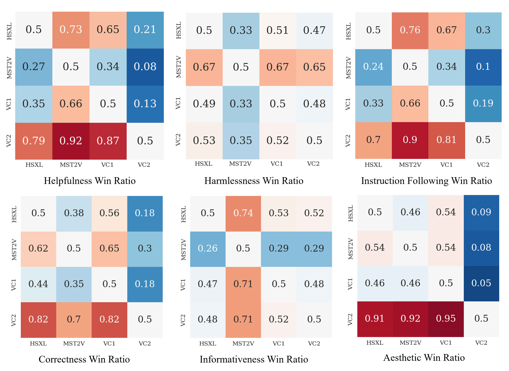

<!-- markdownlint-disable html -->

# Preference Model

In this directory, we provide an example implementation of training a preference predictor reward model on our dataset.

## Preference Modeling

To modeling human preferences, it's common to use a preference predictor adhering to the Bradley-Terry Model. The preference data is symbolized as $y_w \succ y_{l} | x$ where $y_{w}$ denotes the more preferred video than $y_l$ corresponding to the prompt $x$.
The log-likelihood loss used to train a parameterized predictor $R_\phi$ on dataset $\mathcal{D}$ is:

$$\mathcal{L} (\phi; \mathcal{D}) = -\mathbb E_{{(x,y_w,y_l)\sim \mathcal{D}}} \left[\log \sigma (R_{\phi} (y_w,x) - R_{\phi} (y_l,x))\right]$$


Leveraging a multi-modal model architecture modified on the [Video-LLaVA](https://github.com/PKU-YuanGroup/Video-LLaVA) and training with preference data from [SafeSora Dataset](https://huggingface.co/datasets/PKU-Alignment/SafeSora), we have develop a T-V reward model.
The language head of the vision-language model is replaced with a score regression head, which predicts the preference score of the video given the prompt.

This model translates abstract human values into quantifiable and optimizable scalar metrics.
Consequently, the reward model can partially replace human evaluators in assessing outputs from video generation models and act as a supervisory signal to enhance the performance of these models.

## Alignment Evaluation of Different Models

The SafeSora dataset includes annotations across multiple dimensions of human preference. We have developed several distinct models that focus on different aspects of human preference, such as helpfulness, harmlessness, and four specific sub-dimensions of helpfulness. Our models achieve an agreement ratio of 65.29% for predicting helpfulness preference and 72.41% for predicting harmlessness preference when compared with crowdworker assessments.

Furthermore, we utilize these models to evaluate four open-source models on our [Evaluation Dataset](https://huggingface.co/datasets/PKU-Alignment/SafeSora-Eval). The win-rate relationships among these models, assessed across the two alignment dimensions, are depicted in the figure below.

<div align="center">
  
</div>

## Training

First, you need to [download our dataset](../README.md#data-access) to local and prepare the training environment.

Then, you need to download the Video-LLaVA model and the MM-MLP adapter from the Hugging Face model hub. For example, you can download them use the following commands:

```bash
huggingface-cli download --resume-download LanguageBind/Video-LLaVA-7B --local-dir ./LanguageBind/Video-LLaVA-7B
huggingface-cli download --resume-download LanguageBind/Video-LLaVA-Pretrain-7B --local-dir ./LanguageBind/Video-LLaVA-Pretrain-7B
```

Then, you can run the following script to train the reward model on the SafeSora dataset:

```bash
bash examples/scripts/finetune_reward_model.sh \
    --model_name_or_path <your-model-name-or-checkpoint-path> \
    --mm_mlp_adapter_path <your-mm_mlp_adapter_path> \
    --dimension <the-target-dimension-to-train> \
    --output_dir examples/outputs/reward-model
```

where `<your-model-name-or-checkpoint-path>` is the name of the Video-LLaVA model or the path to the checkpoint directory, `<your-mm_mlp_adapter_path>` is the path to the `mm_projector.bin` file, and `<the-target-dimension-to-train>` is the preference dimension that the reward model will predict.

**NOTE:** The parameter 'dimension' specifies the preference dimension that the reward model will predict. The SafeSora dataset currently supports the following dimensions: `helpfulness`, `harmlessness`, `instruction_following`, `correctness`, `informativeness`, and `aesthetics`. For the detailed information of the different dimensions, please refer to our [paper](https://arxiv.org/abs/2406.14477).

## Acknowledgements

This implementation benefits from [DeepSpeed](https://github.com/microsoft/DeepSpeed), [Transformers](https://github.com/huggingface/transformers), [LLaVA](https://github.com/haotian-liu/LLaVA), and [Video-LLaVA](https://github.com/PKU-YuanGroup/Video-LLaVA). Thanks for their wonderful works and their efforts for democratizing the LLM research.
